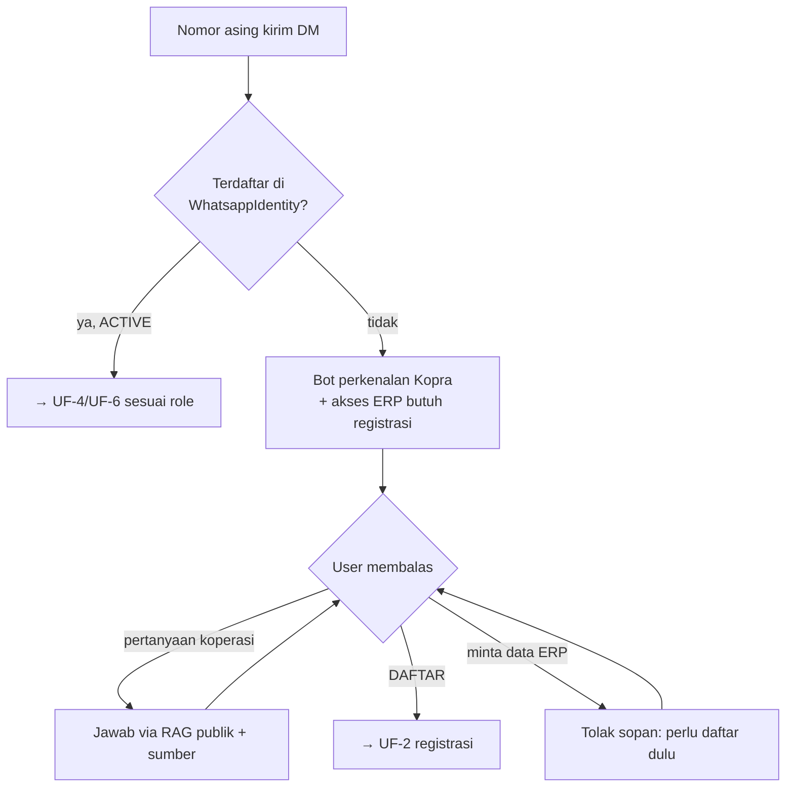
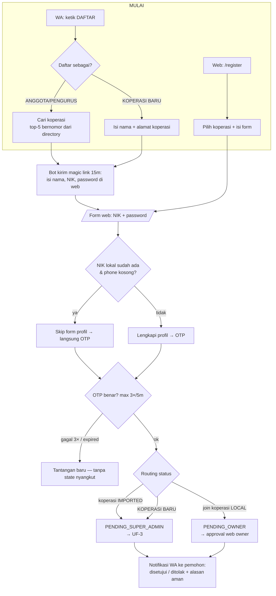
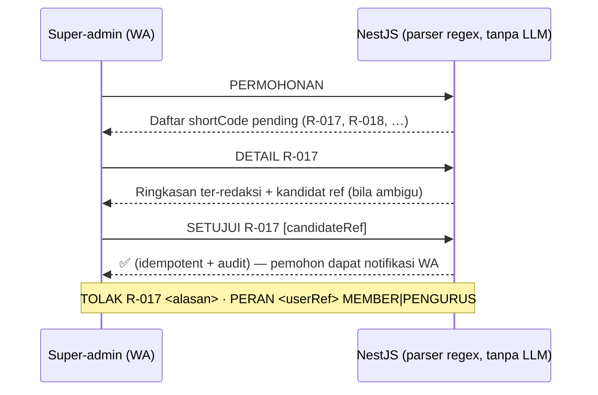
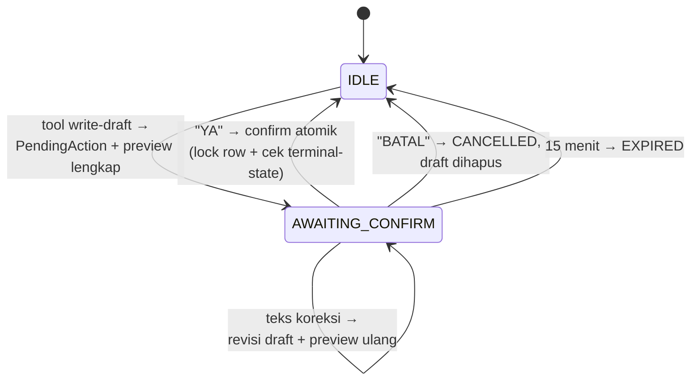
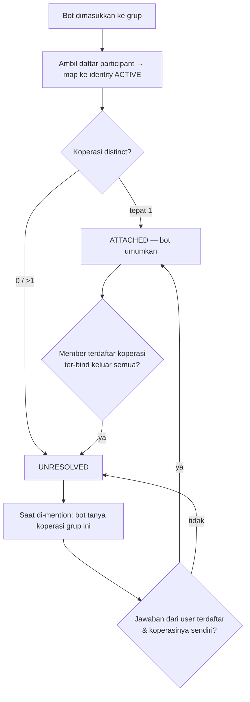

# KOPRA — User Flows (v1)

**Ditulis:** 11 Jul 2026 · **Sumber kebenaran:** [`docs/plans/2026-07-10-kopra-system-build-plan.md`](plans/2026-07-10-kopra-system-build-plan.md) (plan v2 unified) + [`00-core-features.md`](00-core-features.md) §5.
Dokumen ini MERANGKUM alur pengguna untuk tim, pitch deck, dan README — bukan spec baru. Bila bertentangan dengan plan v2, plan v2 yang menang.

**Scope MVP (pengingat CUT):** tanpa OCR/STT/web-chat/pinjaman/POS. Kanal = WhatsApp (DM + grup) dan Web ERP.

---

## 0. Aktor

| Aktor | Siapa | Kanal utama |
|---|---|---|
| **GUEST** | Nomor WA tak dikenal / belum approved | DM, grup (tanya publik saja) |
| **MEMBER** (anggota) | Anggota koperasi terverifikasi | DM/web read-only (transparansi), grup read Inventory |
| **PENGURUS** | Pengurus koperasi | Semua: CRUD via DM preview→YA + web penuh |
| **OWNER** | Pemilik koperasi LOCAL (buatan baru) | = PENGURUS + kelola role member via web |
| **SUPER_ADMIN** | Nomor WA tunggal (`SUPER_ADMIN_WA_NUMBER`), tanpa akun web | Perintah deterministik approval saja |

Matriks akses lengkap: plan v2 §"Matriks akses FINAL" (LOCKED — jangan duplikasi di sini).

---

## UF-1 · Guest: DM pertama (F0)

Guest **tidak pernah** melihat data koperasi mana pun. Satu-satunya kemampuan: tanya publik (RAG) dan mulai registrasi.

---

## UF-2 · Registrasi dual-flow (WA ↔ web)

Prinsip: **NIK tidak pernah dikirim lewat chat** — selalu lewat form web (magic link 15 menit, single-use). OTP dikirim ke nomor WA yang sama (hash, 3 percobaan, 5 menit).

Cabang penting:

- **Pencocokan identitas IMPORTED:** sistem cari kandidat `ImportedIdentity` per koperasi via **prefix NIK masked** (`3402**********01`). Nol/satu/banyak kandidat → SEMUA tetap `PENDING_SUPER_ADMIN`; kalau ambigu, super-admin yang memilih kandidat saat `SETUJUI`.
- **Konflik phone** (NIK lokal ada tapi phone sudah terisi beda) → tolak + eskalasi ke super-admin.
- Request kedaluwarsa **24 jam**, bisa diajukan ulang.
- Approve KOPERASI BARU → koperasi `LOCAL ACTIVE` + pemohon jadi `OWNER`.

---

## UF-3 · Super-admin approval (WhatsApp-only, deterministik pra-LLM)

Super-admin tidak punya akses data ERP — hanya 5 perintah di atas.

---

## UF-4 · Pengurus: CRUD via DM — preview → YA (jalur demo utama, F1/F7)

State machine per chat DM (deterministik, di luar LLM; `PendingAction` di Postgres + snapshot Mastra = **tahan restart**):

Aturan: **satu** PendingAction aktif per chat · duplicate `YA` / webhook dobel = efek sekali · pertanyaan lain saat pending tetap dijawab, bot ingatkan drafnya.

**Contoh F1 — catat transaksi:**

> Pengurus: `catat pemasukan banyu 500rb dari penjualan air galon`
> Bot: `📝 Draft: Pemasukan • BANEW • Rp500.000 → Jurnal: Dr Kas / Cr Pendapatan … Balas YA / BATAL`
> Pengurus: `YA`
> Bot: `✅ Tersimpan JU-061. Saldo kas Rp… <link web>` → muncul di web ≤5s (badge WHATSAPP)

**Contoh F7 — stok kejual (momen demo):** `"kejual minyakita 5"` → SATU preview berisi **dua efek** (movement OUT + jurnal Dr Kas/Cr Pendapatan) → satu `YA` → dua record CONFIRMED atomik → *stok & kas berubah bersamaan di web*. Produk tak dikenal → bot tawarkan draft produk baru.

LLM hanya mengekstrak & menjelaskan; angka, posting rules, dan commit = kode deterministik (`packages/core`).

---

## UF-5 · Read & tanya (DM/web — MEMBER ke atas)

| Flow | Ucapan contoh | Tool | Hasil |
|---|---|---|---|
| F2 tanya keuangan | "bulan ini untung berapa?" | `getFinancialDashboard` | angka hasil SQL, per unit + MoM |
| F3 tanya panduan | "beli stok air masuk operasional atau persediaan?" | `searchCooperativeGuidance` (FTS) | jawaban + sumber |
| F4 penunggak | "siapa yang nunggak simpanan?" | `listUnpaidMembers` | daftar + total + **template pengingat untuk di-copy** (tak pernah auto-broadcast) — khusus PENGURUS/OWNER |
| F5 minta laporan | "minta neraca saldo juni" | `generateFinancialReport` | link laporan web (`?format=html` print) |
| Simpanan diriku | "simpananku gimana?" | `getMySavings` | MEMBER lihat miliknya sendiri |

MEMBER = read-only transparansi (DM & web); intent write dari MEMBER → tolak + jelaskan role yang dibutuhkan, tanpa draft.

---

## UF-6 · Grup WhatsApp (mention-only, tanpa C/U/D)

**Binding koperasi:**

**Perilaku pesan:**

- Semua pesan teks disimpan sebagai konteks bounded (50 pesan / 24 jam) — **tanpa balasan** bila tidak di-mention.
- Bot merespons hanya saat di-mention (native mention, fallback teks `@Kopra`).
- Read sesuai role si pengirim: guest = tanya publik · MEMBER = + read Inventory (stok/produk/kartu stok) · PENGURUS/OWNER = + read Finance (dashboard/laporan/penunggak).
- **Semua intent Create/Update/Delete** → penolakan sopan + arahan ke DM; tidak pernah ada PendingAction dari grup.

---

## UF-7 · Web ERP (surrogate CORE)

1. **Login** (`pengurus@kopra.id` / `anggota@kopra.id`) → JWT ber-role; akun belum approved → 403 `AKUN_PENDING` (halaman status menunggu).
2. **Pengurus/Owner:** Dashboard kartu ala CORE → COA (tree) → Jurnal (buat/confirm; entri dari WA berbadge WHATSAPP, polling 5s) → Produk + kartu stok → Anggota + simpanan (bayar rapel → jurnal SAVING_PAYMENT) → Laporan ×5 (Buku Besar, Neraca Saldo, PHU, Neraca, Buku Kas — print-ready "siap RAT").
3. **Owner LOCAL:** `/pengurus/persetujuan` untuk approve join member + kelola role.
4. **Member:** halaman sama, read-only (tombol aksi disembunyikan) — transparansi anggota.
5. **Registrasi web:** `/register` (web-first) · `/register/complete?token=` (lanjutan dari WA) · `/register/verify` (OTP).

CONFIRMED immutable — koreksi = jurnal balik / movement ADJUST (jawaban juri: auditability RAT).

---

## UF-8 · Jalur demo juri (happy path 5 menit)

1. **Guest DM** → intro + RAG publik → `DAFTAR` → magic link → OTP → super-admin `SETUJUI R-xxx` → welcome.
2. **Pengurus DM:** `catat pemasukan banyu 500rb` → preview → `YA` → tampil di web ≤5s.
3. **Momen inti:** `kejual minyakita 5` → satu `YA` → **stok & kas berubah bersamaan** di web ("dua buku tercatat sekali chat").
4. **Grup:** bot di-add → auto-ATTACHED → member mention "stok minyakita berapa?" → dijawab; minta "catat…" → diarahkan ke DM.
5. **Web:** dashboard → laporan PHU/Neraca print-ready → closing: dari <1% aktif → tercatat, terukur, siap mitra & pembiayaan.
